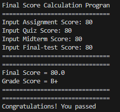
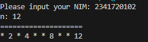
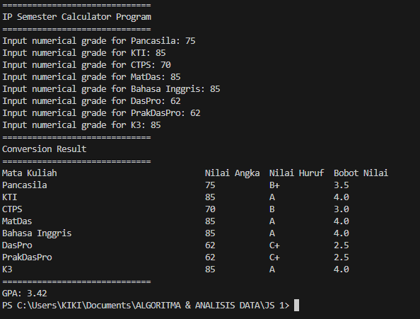
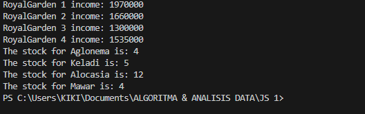

|  | Algorithm and Data Structure | 
|--|--|
| NIM | 244107020140 |
| NAME | Muhammad Rizki |
| CLASS | TI - 1I |
| REPO | |

# JOBSHEET 1 Programming Fundamental Review

## 2.1.1 Selection

The solution is implemented in GradingSystem.java and below is the screenshot of the result.

**Brief Explanation** 
1. Input all of the grade accordingly from 1-100.
2. The program will check whether there are score that are under 0 and/or above 100.
3. The program will calculate the final score and also show the grade score accordingly.
4. The program will show whether the user passed or failed.

## 2.2.1 Looping 

The solution is implemented in looping.java and below is the screenshot of the result.

**Brief Explanation**
1. Input nim.
2. The program will extract the last two digits from the nim.
3. If the extracted number less than 10, then it will adds 10 to ensure it more than 10.
4. The program runs a loop from 1 till nimn.
5. inside the loop, the program will skip number 6 and 10, prints (*) for odd number, and print even number.

## 2.3.1 Array

The solution is implemented in gpaCalculation.java and below is the screenshot of the result.

**Brief Explanation**
1. Input score according to the course.
2. Convert numerical grade into alphabetical grade.
3. Convert alphabetical grade into grade score.
4. Multiply grade score with sks accordingly (totPoint).
5. Total all sks.
6. Display each course's scores (numerical, alphabetical, grade(bobot)).
7. Display the GPA by calculate totPoint divided by total sks.

## 2.4.1 Function

The solution is implemented in functionAhay.java and below is the screenshot of the result.

**Brief Explanation**
1. Flowers stock for each branch and the prices for each flower type has been predefined in the program.
2. The program will call incomeEach method for displaying the income for each branch if all the flowers S.O.
3. incomeEach method iterate through each shop , then a nested loop iterate through each flower type.
4. IncomeEach method multiply each flower type by its price and then display the result.
5. The main method will cal stockManagement method for displaying current stock in RoyalGarden 4.

## 3.1 Assignment 1

The solution is implemented in vPlate.java and below is the screenshot of the result.

**Brief Explanation**
1. Predefine each cities code and the name of the city accordingly.
2. Input the city code.
3. The program will check whether the city code and the city name matched through looping.
4. Display the result.

## 3.2 Asssignment 2