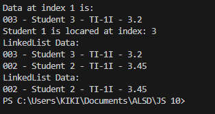

|  | Algorithm and Data Structure |
|--|--|
| NIM |  244107020140|
| Nama |  Muhammad Rizki |
| Kelas | TI - 1I |
| Repository | [link] (https://github.com/emrizky1/2ndSemester) |

# Lab 12 Linked List

## 2.1 Result -- Implementing Single Linked List

The solution can be seen in:
- `Student.java`
- `Node.java`
- `Main.java`
- `SingleLinkedList.java`

The screenshot of the result can be seen below:

## 2.1.3 Questions  
**Answers**

1. Because initially, the linked list is empty, so the `head` is `null`. The `print()` method checks `isEmpty()` and prints "LinkedList is empty!!" since no data exists yet.

2. The purpose of the variable `temp` is to serve as a temporary pointer used to pass through the list. It prevents modifying the original `head` and is commonly used in loops to process each node.

3. You can see the modified program in `main.java`

4. If `tail` is not used, then each time we want to add to the end, we must pass the entire list to find the last node. This would make `addLast()` slower.

---

## 2.2 Result -- Accessing Element in Single Linked List

The continuation of the solution is in:
- `Main.java`
- `SingleLinkedList.java`

The screenshot of the result can be seen below:

## 2.2.3 Questions  
**Answers**

1. Because the `break` statement is used to immediately exit the loop once the condition is met (when the target node is found and removed). Without `break`, the loop may continue unnecessarily.

2. The purpose is to remove the current node by skipping it in the chain. This ensures the node is removed and the `tail` is updated if the deleted node was the last one.

---

## Assignment

The solution can be seen in:
- `NStudent.java`
- `NNode.java`
- `StudentQueue.java`
- `newMain.java`

The screenshot of the result can be seen below:

