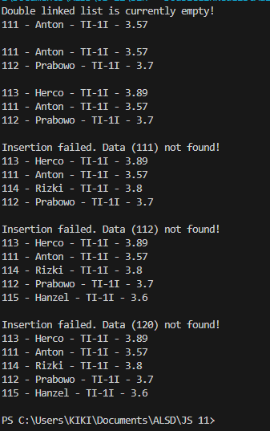
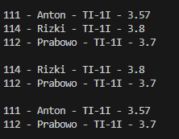

|  | Algorithm and Data Structure |
|--|--|
| NIM |  244107020140|
| Nama |  Muhammad Rizki |
| Kelas | TI - 1I |
| Repository | [link] (https://github.com/emrizky1/2ndSemester) |

# Lab 13 Double Linked List

## 12.2 Result -- Double Linked List Basic Operations

The solution can be seen in:

* `Student.java`
* `Node.java`
* `DoubleLinkedLists.java`
* `DoubleLinkedListsMain.java`

The screenshot of the result can be seen below:



## 12.2.3 Questions

**Answers**

1. A single linked list allows traversal in only one direction, while a double linked list allows traversal in both forward and backward directions.

2. The `next` attribute is used to point to the next node, while `prev` points to the previous node. They allow bidirectional traversal together.

3. The constructor `DoubleLinkedLists()` initializes both `head` and `tail` to `null`, indicating that the list is initially empty.

4. The code means that if the list is empty, the new node becomes the head and the tail.

5. The statement `head.prev = newNode` links the old head's `prev` pointer to the new node, maintaining the backward connection from the old head's to the new node.

6. The statement `current.next.prev = newNode` updates the `prev` link of the node after the current / temp point to maintain the correct backward connection (connect to the newNode).

7. The traversal is implemented in the `print()` and `insertAfter()` methods. The statement `temp = temp.next` means moving the temporary pointer to the next node in the list.

8. Used to simplify the logic for adding new data to the end. If removed, you can manually set `tail.next` and `newNode.prev` to connect properly.

9. The statement `if(temp.data.nim.equalsIgnoreCase(key))` checks if the current node's NIM matches the key. This determines where to insert the new node.

---

## 12.3 Result -- Deleting from Double Linked List

The continuation of the solution is in:

* `DoubleLinkedLists.java`
* `DoubleLinkedListsMain.java`

The screenshot of the result can be seen below:



## 12.3.3 Questions

**Answers**

1. Moves the head to the next node and resets the previous pointer to maintain list integrity.

2. Ensures that when there is only one node, removing it correctly resets the list to empty.

3. Without the `tail` attribute, we’d need to traverse from the head to find the second-to-last node every time we remove the last node — making the operation slower.

4. To prevents errors from trying to access or remove from an empty list.

5. For index 0, it calls `removeFirst()` to remove the head. If the node is the tail, it calls `removeLast()`. These ensure proper edge handling.

6. It updates the `next` reference of the previous node and the `prev` reference of the next node to unlink the current node safely from the middle.

7. To handle invalid indices, you can modify `remove(int index)` like this:

```java
if(index < 0 || index >= getSize()) {
    System.out.println("Invalid index!");
    return;
}
```

---

## 12.5 Assignment

The solution can be seen in:

* `DoubleLinkedLists.java`
* `DoubleLinkedListsMain.java`

The screenshot of the result can be seen below:


