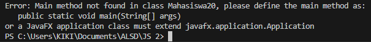
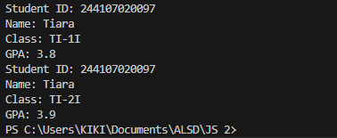
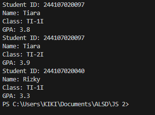
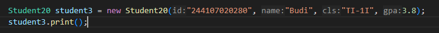
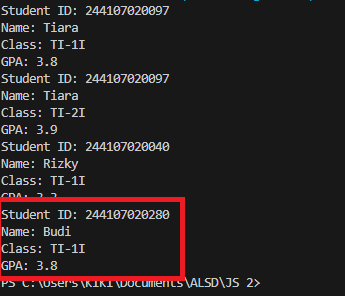

|  | Algorithm and Data Structure | 
|--|--|
| NIM | 244107020140 |
| NAME | Muhammad Rizki |
| CLASS | TI - 1I |
| REPO | [link] (https://github.com/emrizky1/2ndSemester) |

# JOBSHEET 2 Object

## 2.1.2 Verification of Experiment Result

## 2.1.3 Questions

**Answers**
1. Characteristic of Object: Has something (Data, property, Variable, etc), can do something (Behaviour, function, method), specific.
Characterictic of Class: General.
2. It has 4 attributes: String studentID, String name, String className, double gpa.
3. It has 4 methods: print, changeClass, updateGPA, evaluate.
4. Add if statement to check if ipk > 4 / ipk < 0. Also add an error statement when it is out of range.
5. The program uses the gpa score to evaluates student performances. The program will return String value and the result will be depend on the student's gpa score.

## 2.2.2 Verification of Experiment Result

## 2.2.3 Questions

**Answers**
1. Student20 student1 = new Student20();. The name of the created object is student1
2. To access attributes of an object is by typing objectName.attributeName.
To acces methods of an object is by typing objectName.methodName(). You can input the parameters if needed.
3. It's because after the first print, the program calls student1.changeClass and student1.updateGPA which those methods are for updating the class and the gpa to the current value. Therefore, the output of the first print and the second print are different.

## 2.3.2 Verification of Experiment Result

## 2.3.3 Questions

**Answer**
1. public Student20(String id, String name, String cls, double gpa)
2. The following line are for calling constructor on instantiation using parametric.
3. The program will show an error because the student1 is not using parametric for instantiation and since the default constructor has been deleted, the student1 need to use the parametric one.
4. No, we can call methods in any order that we want. But, if it has any dependencies between one method to another, then we need to make sure that it is called in the right order.
5. The screenshot of the code and the result are below:

