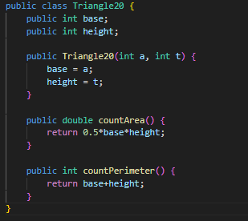

|  | Algorithm and Data Structure | 
|--|--|
| NIM | 244107020140 |
| NAME | Muhammad Rizki |
| CLASS | TI - 1I |
| REPO | [link] (https://github.com/emrizky1/2ndSemester) |

# Array Of Object

## 1.2. Create, insert, and display Array of Object

you could see the program in ArrayOfObject20.java and Rectangle20.java

**Answers**
1. No, a class doesn't need attributes or methods to be used in an array, but they help define object behavior and properties.
2. No, Rectangle20 has no constructor, but Java provides a default constructor that initializes attributes to default values.
3. It creates an array to hold three Rectangle20 object references, but the objects are not yet instantiated.
4. It creates a new Rectangle27 object at index 1 and assigns values to its length (80) and width (40).
5. Separation improves modularity, reusability, readability, and encapsulation, keeping object definition (Rectangle20) and logic (ArrayOfObjects20) distinct.

## 1.3 Input data into Array of Objects using Loops

you could see the program in ArrayOfObject20.java and Rectangle20.java

**Answers**
1. Yes,  a 2D array of objects in Java works just like a regular 2D array, but it stores objects instead of simple data types
2. 
3. squareArray[5] is null. Declaring new Square[100] only creates an array to hold Square object references, but no objects are instantiated
4. 
5. The previous data of the object will be replaced by the new data.

## 1.4 Mathematical operation in array of object’s attribute

you could see the program in Blocks20.java and ArrayBlocks20.java

**Answers**
1. Yes, it allows us to create object in different way by using different parameters.
2. 
3. 
4. 
5. 

## 1.5 Assignment

you could see the program in Lecturer20.java, LecturerData20.java, and LecturerDemo20.java

**Lecturer 20**
1. This is the class for Lecturer object

**LecturerData20**
1. This is for proccesing the data and also displaying it

**LecturerDemo20**
1. This is for inputting the data of the lecturer and also calling all the methods inside the LecturerData20 for processing what we've just inputted.

