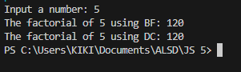

|  | Algorithm and Data Structure |
|--|--|
| NIM |  244107020140|
| Nama |  Muhammad Rizki |
| Kelas | TI - 1I |
| Repository | [link] (https://github.com/ukakooo/2ndSemester-PraktALSD) |

# Labs #1 Calculating Factorial Using Brute Force and Divide and Conquer Algorithms

## 5.2.2 Verification of Experiment Results
The solution can be seen in Factorial.java and MainFactorial.java, the screenshot of the result can be seen below

## 5.2.3 Questions
**Answers**
1. the if statement is to make sure when n reaches 1 it only return as 1 (base case), so it will stop the calculation. The else statement is to calculate the factorial of n.
2. 