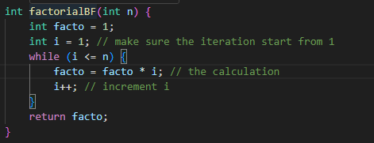
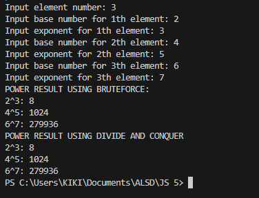
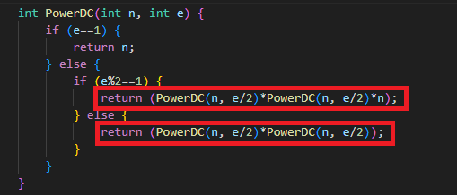
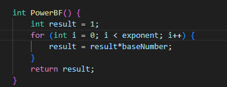
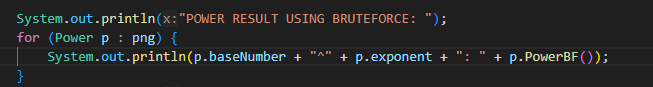

|  | Algorithm and Data Structure |
|--|--|
| NIM |  244107020140|
| Nama |  Muhammad Rizki |
| Kelas | TI - 1I |
| Repository | [link] (https://github.com/emrizky1/2ndSemester) |

# Labs #1 Calculating Factorial Using Brute Force and Divide and Conquer Algorithms

## 5.2.2 Verification of Experiment Results
The solution can be seen in Factorial.java and MainFactorial.java, the screenshot of the result can be seen below

## 5.2.3 Questions
**Answers**
1. the if statement is to make sure when n reaches 1 it only return as 1 (base case), so it will stop the calculation. The else statement is to calculate the factorial of n.
2. we can use while loop as an alternative, it basically run the same as for loop, the structure is the only different in here. 

3. how brute force method (facto = facto * i) works by gradually calculating the factorial by the program, each iteration will times (*) itself with facto until i <= n.
how DC method works are it reduces the problem size by 1 in each call (n-1), until it reaches the base case where n == 1. At that point, it starts returning results and multiplying them back up the call stack. This gradually builds the final factorial.
4. factorialBF() uses iterative approach while factorialDC() uses recursive approach. Both give the same result but both have their own approach.

## 5.3.2 Verification of Experiment Results
The solution can be seen in Power.java and PowerMain.java, the screenshot of the result can be seen below

## 5.3.3 Questions
**Answers**
1. PowerBF() uses iterative approach where n multiplies by itself for e times. PowerDC() uses divide and conquer approach where it breaks problem into small parts, it then combines the result by multiplying n.
2. The relevant part can be seen below:

3. Yes, it can be implemented without parameters. Just use the initial variables name like image below.

4. 