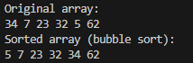
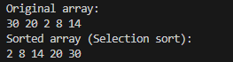
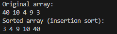
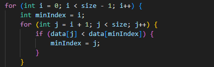
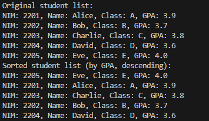
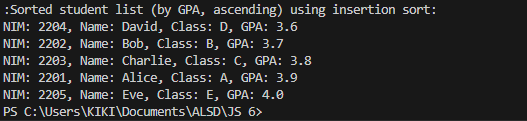
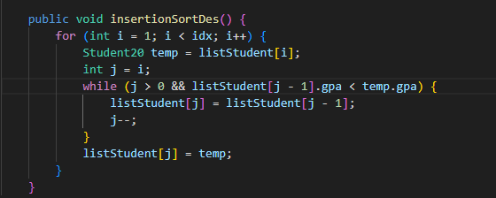
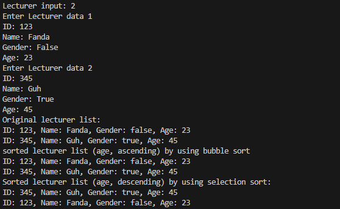
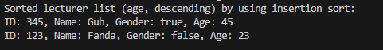

|  | Algorithm and Data Structure |
|--|--|
| NIM |  244107020140|
| Nama |  Muhammad Rizki |
| Kelas | TI - 1I |
| Repository | [link] (https://github.com/emrizky1/2ndSemester) |

# Labs #1 Implementing Sorting Using Objects

## 6.2.2 Verification of Experiment Results
The solution can be seen in Sorting20.java and SortingMain20.java, the screenshot of the result can be seen below

## 6.2.3 Verification of Experiment Results
The solution can be seen in Sorting20.java and SortingMain20.java, the screenshot of the result can be seen below

## 6.2.4 Verification of Experiment Results
The solution can be seen in Sorting20.java and SortingMain20.java, the screenshot of the result can be seen below

## 6.2.5 Questions
**Answers**
1. This is where larger number are moved to the right.

2. 

3. it's for checking condition whether j is not negative and the current vcalue (J) are bigger than the key. If both conditions are true then the current value is shifted to the right.
4. this is where the current value get shifted to the right.

# Labs #2 Sorting Using an Array of Objects

## 6.3.3 Verification of Experiment Results
The solution can be seen in Student20.java, TopStudent20.java, and StudentDemo20.java, the screenshot of the result can be seen below

## 6.3.4 Questions
**Answers**
1. because the largest value will be in its correct position eventually, there's no need to check again for the largest value.
2. because we don't go beyond the unsorted part of the array, the last i are already sorted, so there is no need to check it again.
3. idx = 50, so idx - 1 = 49
4. You can see the modified version at UpdStudentDemo20.java

## 6.3.12 Verification of Experiment Results
The solution can be seen in Student20.java, TopStudent20.java, and StudentDemo20.java, the screenshot of the result can be seen below

## 6.3.13 Questions
**Answers**
1. The screenshot of the result can be seen below

## Assignment

## Verification of Experiment Results
The solution can be seen in Lecturer20.java, LecturerData20, and LecturerDemo20.java, the screenshot of the result can be seen below

