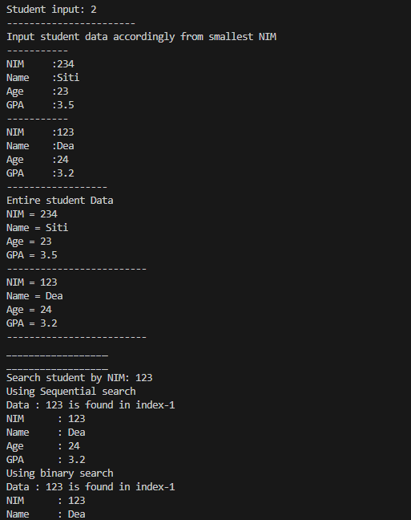

|  | Algorithm and Data Structure |
|--|--|
| NIM |  244107020140|
| Nama |  Muhammad Rizki |
| Kelas | TI - 1I |
| Repository | [link] (https://github.com/emrizky1/2ndSemester) |

# Lab 1 Sequential Search Method

## 7.2 Result
The solution can be seen in Students.java, MainStudent.java, and SearchStudents.java, the screenshot of the result can be seen below

## 7.3 Questions
**Answers**
1. showPosition only show where the data is found but not the student data detail, while showData is showing the detail of the student.
2. It's to immediately stop the loop when the nim that we looking for is found.
3. No, because sequential search checks each value one by one regardless about the order so it will be run just fine.
4. To indicate that no matching data was found.

# Lab 2 Binary Search Method

## 7.2 Result
The solution can be seen in Students.java, MainStudent.java, and SearchStudents.java, the screenshot of the result can be seen below

## 7.3 Questions
**Answers**
1. You can see the divide process on screenshot that I provided below

2. You can see the conquer process on screenshot that I provided below

3. No, it won't give the correct result because this method assume that the data is already sorted. If it sorted from largest to smallest value, in this case, it sill going to show the wrong result. To make the result correct, we need to edit the code like the screenshot I provided below

(change > operator to < operator)

4. You can see the code in MainStudent.java and SearchStudent.java, the example of the result is provided below

# Lab 3 Review Divide and Conque

## 7.2 Result
The solution can be seen in MergeSort.java and SortMain.java, the screenshot of the result can be seen below

# Assignment

## Result
The solution can be seen in Lecturer20.java, LecturerData20.java, and LecurerDemo20.java, the screenshot of the result can be seen below

