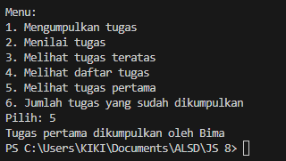
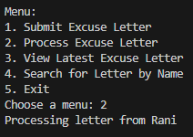

|  | Algorithm and Data Structure |
|--|--|
| NIM |  244107020140|
| Nama |  Muhammad Rizki |
| Kelas | TI - 1I |
| Repository | [link] (https://github.com/emrizky1/2ndSemester) |

# Lab 1 Stack

## 2.1 Result – Stack for Student Assignment Submission

The solution can be seen in:
- `Student20.java`
- `StudentAssignmentStack20.java`
- `StudentDemo20.java`

The screenshot of the result can be seen below:

## 2.1.3 Questions  
**Answers**

1. Because the most recently submitted assignment is on top and should be graded first.

2. `push()` adds a student assignment to the top of the stack (submitting the assignment), while `pop()` removes the assignment from the top (grading the assignment).

3. It is necessary to check `!isFull()` before pushing to prevent accessing out-of-bounds in the array. Without this check, the program may not work as intended (not optimal).

4. The stack can store up to 5 assignments, as shown in the code:  
   `StudentAssignmentStack20 stack = new StudentAssignmentStack20(5);`

5. I added a `bottom()` method in the `StudentAssignmentStack20` class to return `stack[0]` and added a menu option in `StudentDemo20` to display it. You can see it in `StudentAssignmentStack20` line 60 and in `StudentDemo20` line 60 and the result can be seen above

6. I added a `count()` method that returns `top + 1`, indicating how many items are currently in the stack. You can see it in `StudentAssignmentStack20` line 69 and in `StudentDemo20` line 67 and the result can be seen above

7. I learned how to use and implement stack logic using Java, particularly how LIFO behavior is suitable for systems like undo operations, browser history, or assignment submissions.

---

## 2.2 Result – Convert Assignment Grade to Binary

The solution is already implemented in:
- `StudentAssignmentStack20.java`
- `ConversionStack20.java`
- `StudentDemo20.java` 

The screenshot of the result can be seen below:

## 2.2.3 Questions  
**Answers**

1. `convertToBinary()` creates a temporary stack for binary digits. It divides the grade by 2 repeatedly, pushing each remainder to the stack. Then it pops all values to construct the binary string in the correct order.

2. Changing the loop to `while (grade != 0)` gives the same result except for grade = 0. It will return an empty string.

---

# Assignment – Excuse Letter Stack

## Result

The solution can be seen in:
- `ExcuseLetter20.java`
- `ExcuseLetterStack20.java`
- `ExcuseLetterDemo20.java`

The screenshot of the result can be seen below:

