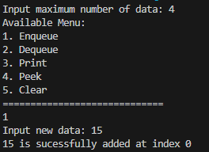
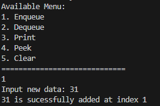
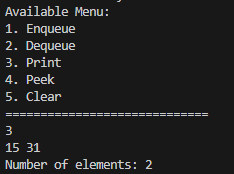
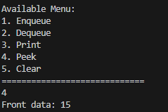
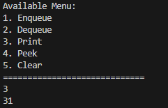

|  | Algorithm and Data Structure |
|--|--|
| NIM |  244107020140|
| Nama |  Muhammad Rizki |
| Kelas | TI - 1I |
| Repository | [link] (https://github.com/emrizky1/2ndSemester) |

# Lab 1 Queue

## 2.1 Result -- Queue Basic Operations\

The solution can be seen in
- `Queue20.java`
- `QueueMain20.java`

The screenshot of the result can be seen below:

## 2.1.3 Questions
**Answers**

1. Because front and rear save the index of the data respectfully, so for initial value is -1. While size's function is to save the current length of the array, so the initial value is 0.

2. The purpose is to input a new data (rear) when the rear of the queue is in the last index of the array.

3. The purpose is to remove a data (front) when the front data is in the last index of the array.

4. Because front is not always in index 0, especially when deque has occured.

5. to ensures the index stays within bounds of the array and loops back to the start when necessary.

6. The snippet can be seen in `Enqueue()` inside `Queue20.java` specifically the else statement where it print "Queue is full!!!"

7. I added `System.exit(1)` inside `Enqueue()` and `Dequeue()` methods, specifically at the else statement. System.exit(1) function is to stop the program and (1) means abnormal stop / termination.

