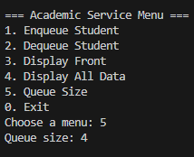

|  | Algorithm and Data Structure |
|--|--|
| NIM |  244107020140|
| Nama |  Muhammad Rizki |
| Kelas | TI - 1I |
| Repository | [link] (https://github.com/emrizky1/2ndSemester) |

# Lab 1 Queue

## 2.1 Result -- Queue Basic Operations\

The solution can be seen in
- `Queue20.java`
- `QueueMain20.java`

The screenshot of the result can be seen below:

## 2.1.3 Questions
**Answers**

1. Because front and rear save the index of the data respectfully, so for initial value is -1. While size's function is to save the current length of the array, so the initial value is 0.

2. The purpose is to input a new data (rear) when the rear of the queue is in the last index of the array.

3. The purpose is to remove a data (front) when the front data is in the last index of the array.

4. Because front is not always in index 0, especially when deque has occured.

5. to ensures the index stays within bounds of the array and loops back to the start when necessary.

6. The snippet can be seen in `Enqueue()` inside `Queue20.java` specifically the else statement where it print "Queue is full!!!"

7. I added `System.exit(1)` inside `Enqueue()` and `Dequeue()` methods, specifically at the else statement. `System.exit(1)` function is to stop the program and (1) means abnormal stop / termination.

## 2.2 Result -- Academic Service Queue

The solution can be seen in
- `Student.java`
- `StudentQueue.java`
- `StidemtQueueMain.java`

The screenshot of the result can be seen below:

## 2.2.3 Questions
**Answers**
1. Because Queue uses int[] to store primitive integer values, while StudentQueue uses Student[] to store student objects. This change is important because Student objects contain multiple attributes (NIM, name, etc.) which can't be represented with a single integer.

2. n StudentQueue, enqueue() accepts a Student object and stores it in the array, and dequeue() returns a Student object. In contrast, the Queue class works with integers. The logic is mostly the same, but the data type and object handling differ.

3. Because in StudentQueue, front is initialized to 0 to avoid errors when accessing data[front]. If front is set to -1 like in the basic Queue class, it would cause an ArrayIndexOutOfBoundsException when trying to access data[-1].

4. I added a viewRear() method inside StudentQueue.java. This method is used to display the last/rear student in the queue. I also added a new option in the menu inside StudentQueueMain.java labeled “6. Check rear of the queue,” so that the method can be executed from the main menu.

---

# Assignment 

The solution can be seen in:
`Student.java`
`Queue.java`
`queueMain.java`

The screenshot of the result can be seen below:

