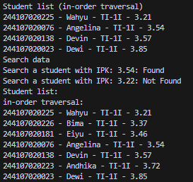
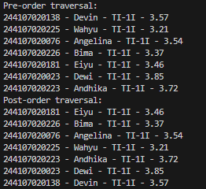
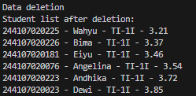
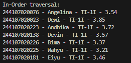
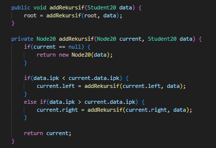
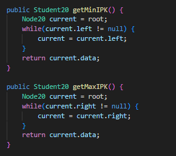
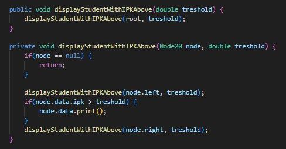
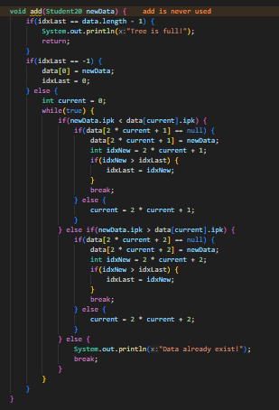
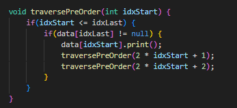

|  | Algorithm and Data Structure |
|--|--|
| NIM |  244107020140|
| Nama |  Muhammad Rizki |
| Kelas | TI - 1I |
| Repository | [link] (https://github.com/emrizky1/2ndSemester) |

# Lab 14 Tree

## 14.2.1 Result -- Implementation of Binary Search Tree Using Linked List 

The solution can be seen in:

* `BinaryTree20.java`
* `Node20.java`
* `BinaryTreeMain20.java`
* `Student20.java`

The screenshot of the result can be seen below:

## 14.2.2 Questions

**Answers**

1. Because in binary search tree, the data has already been sorted so we don't need to sort the data first like in array for example.

2. so we can add and / or traverse data into left subtree and / or right subtree.

3. a. To initialize the first data into the tree (the first node).
   b. The initial value of root is null because there is no data inserted yet.

4. It will set the node to root. The system will check whether the tree is empty or not, if yes then the system will add the node as root. You can see more detail in `add()` function inside `BinaryTree20.java`.

5. The purpose is to determine whether the new data is set into the left / right subtree. The first if condition is when the new data value is smaller than the current node's data, the system will bring the new data into the left side of the tree and vice versa. If the current right / left child is null then it will place the new data in one of the direction depend on the value of the new data.

6. `getSuccessor()` help maintaining the Binary Search Tree sorted and also save the childrens of the node that will be deleted. To find the successor of the deleted node, the program will traverse to the leftest node in its right subtree. Then, in `delete()` method, the successor will replace the deleted node positions and its left and right children are updated as needed to maintain the correct order and structure.

---

## 14.3.1 Result -- Implementation of Binary Tree Using Array 

The solution can be seen in:

* `BinaryTreeArray20.java`
* `BinaryTreeArrayMain20.java`

The screenshot of the result can be seen below:

## 14.3.2 Questions

**Answers**

1. `data` is to insert the added data into the array, while `idxLast` is to keep track the last index of the array to check the current array length and also to make the process easier when the user wants to add another data into the array.

2. to save / store the data into the Student20 array and also to save the current length of the array.

3. to traverse and print throughout the Binary Search Tree in-orderly (left subtree -> root -> right subtree).

4. if a binary tree node is stored at index 2 in the array, the left children will located at index 5 (2 * index + 1) and the right children will located at index 6 (2 * index + 2).

5. it indicates that the last node inserted into the data array is at index 6, meaning the tree currently contains 7 elements (from index 0 to 6).

6. 2 * index + 1 is referencing to node's left child and 2 * index + 2 is referencing to node's right child. 

---

## 14.4 Assignment

The solution can be seen in:

* `BinaryTree20.java`
* `BinaryTreeArray20.java`

The screenshot of the result can be seen below:

